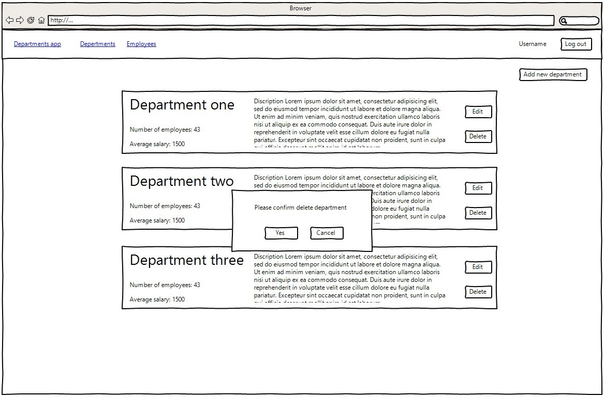

<h2>Department App</h2>
## Vision

### "Department App" is a web application for managing departments and employees.

Application should provide:
- Registration and authorization.
- Storing departments and employees in database.
- Display list of departments and average salary of employees in these departments.
- Display list of all employees.
- Display list of employees for each department.
- Search for employees by birthday date.
- Searching employees born in specified period.
- Managing departments and employees (adding / editing / removing).
## 1. Homepage
On the home page user can see main information about this application. By clicking button 'Get started' unauthorized user will be redirected to log in and after login he will be redirected to departments page. 
Authorized user sees all buttons and can go to departments or employees page.
#### Main scenario:
- User opens a site;
- Application homepage is displayed.

Pic. 1.1 Homepage for unauthorized user.

Pic. 1.2 Homepage for authorized user.
## 2. Login
### 4.1 Display the signin form
#### Main scenario:
User inputs data and signs in to account.

Pic. 1.2 Login page.
## 3. Registration
### 3.1 Display the signup form.
#### Main scenario:
User inputs data and creates an account.

Pic. 1.2 Registration page.
## 4. Departments
### 4.1 Display list of departments
The mode is designed to view the list of departments.
#### Main scenario:
- User selects item "Departments";
- Application displays list of departments.

Pic. 4.1 View the Department list.
The list displays the following columns:
- Department name;
- Department description;
- Number of employees;
- Average salary.
### 4.2 Edit department
#### Main scenario:
- User clicks 'Edit' button in the departments list view mode;
- Application displays a popup window with input fields filled by current department data;
- User changes data and presses the "Save" button or clicks '<b>x</b>' icon to close the window. 

Pic. 4.2 Editing a department.
### 4.3 Delete department
#### Main scenario:
- User clicks 'Delete' button in the departments list view mode;
- Application displays a popup window to confirm deleting;
- User clicks 'Yes' button to confirm deleting or 'Cancel' button to cancel deleting.

Pic. 4.3 Deleting a department.
### 4.4 Add new department
#### Main scenario:
- User clicks 'Add new department' button on the departments page;
- Application redirects user to the page with form for adding department.
- User inputs data and clicks 'Save' to save it to database or 'Cancel' to go back.

Pic. 4.4 Adding new department.
## 5. Employees
### 5.1 Display list of employees
The mode is designed to view the list of employees.
#### Main scenario:
- User selects item "Employees";
- Application displays list of employees.

Pic. 5.1 Employees page.
### 5.1 Edit employee
#### Main scenario:
- User clicks 'Edit' button in the employees list view mode;
- Application displays a popup window with input fields filled by current employee data;
- User changes data and presses the "Save" button or clicks '<b>x</b>' icon to close the window. 

Pic. 4.1 Editing an employee.
### 5.1 Delete employee
#### Main scenario:
- User clicks 'Delete' button in the employees list view mode;
- Application displays a popup window to confirm deleting;
- User clicks 'Yes' button to confirm deleting or 'Cancel' button to cancel deleting.

Pic. 5.1 Deleting an employee.
### 5.1 Add new employee
#### Main scenario:
- User clicks 'Add new employee' button on the employees page;
- Application redirects user to the page with form for adding an employee.
- User inputs data and clicks 'Save' to save it to database or 'Cancel' to go back.

Pic. 5.1 Adding new employee.